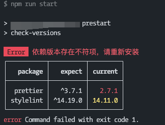

# @bowencool/check-versions

## usage
``` bash
npm i @bowencool/check-versions -D
```
In your package.json:
``` json
{
	"scripts": {
		"prebuild": "check-versions",
		"prestart": "check-versions"
	}
}
```

